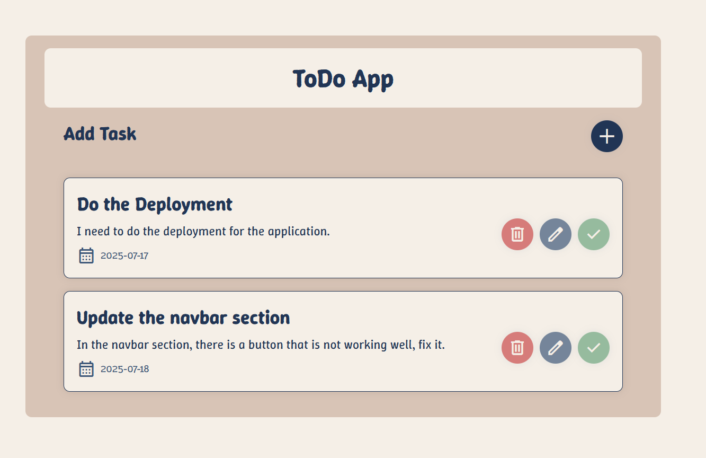
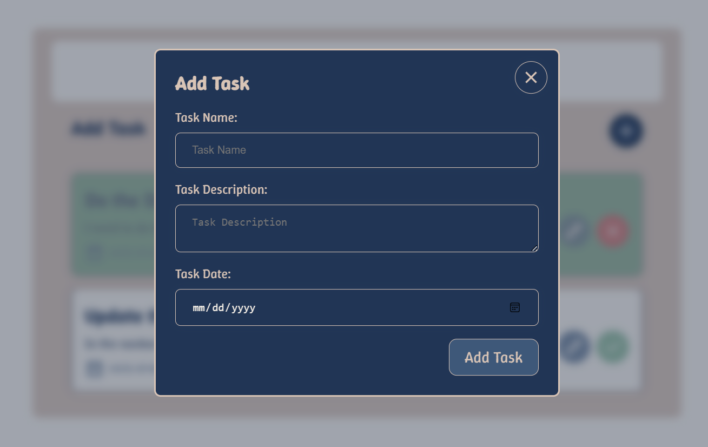
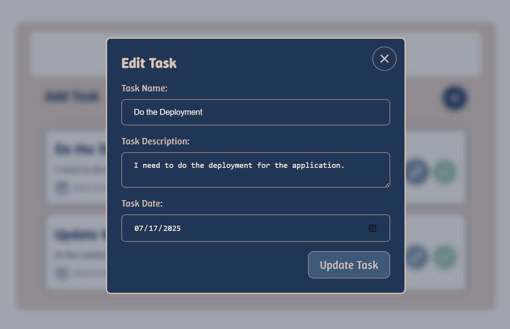
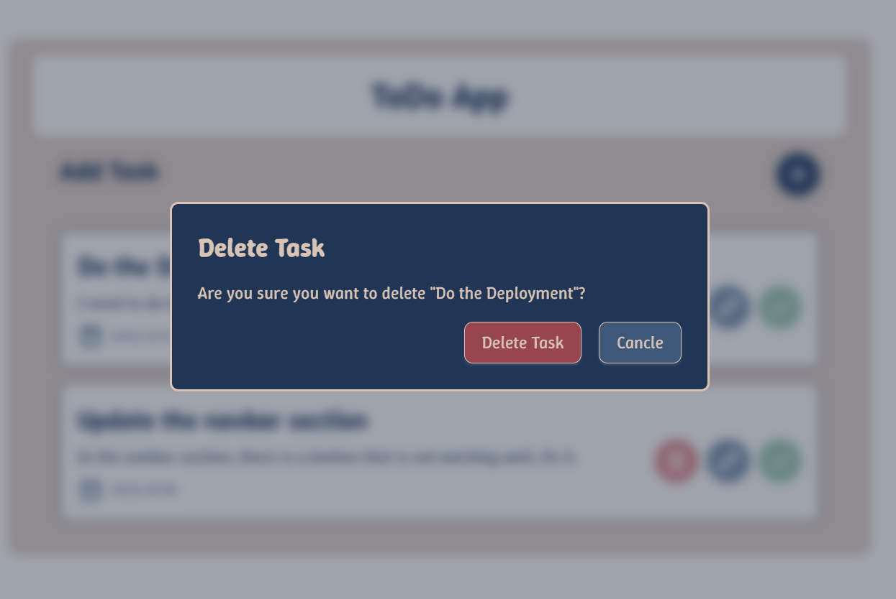
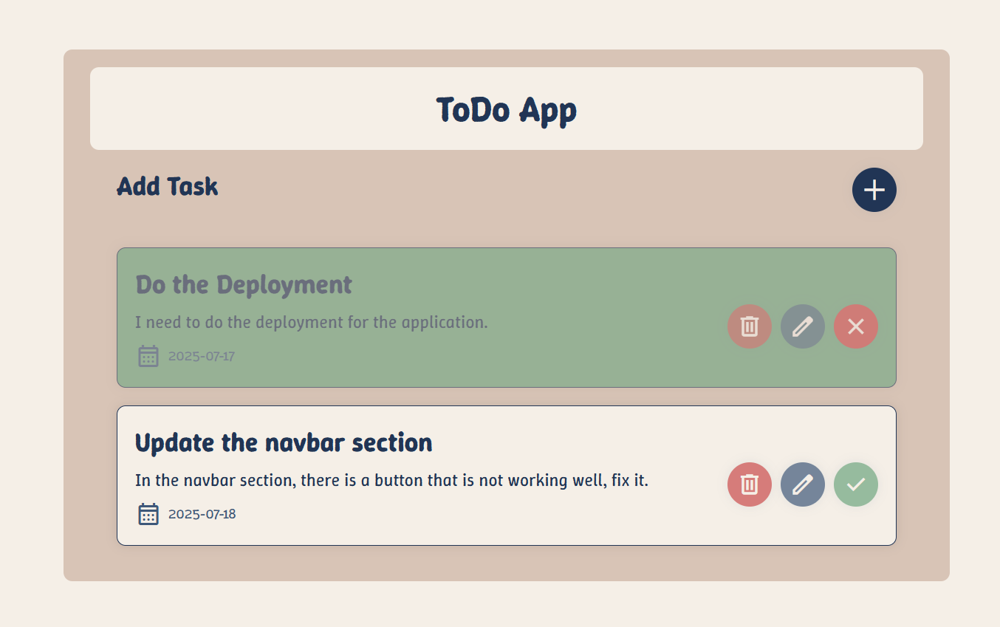

# 📝 ToDo App

A simple, modern, and responsive **ToDo App** built with **HTML**, **CSS**, and **JavaScript**. This app helps users manage their daily tasks efficiently by allowing them to add, edit, delete, and mark tasks as complete. It uses **localStorage** for data persistence.

---

## 📸 Preview

---

## 🚀 Features

- ✅ Add, edit, delete, and mark tasks as complete or canceled  
- ✅ Responsive layout for all screen sizes  
- ✅ Modal popups for forms  
- ✅ Smooth hover and transition effects  
- ✅ LocalStorage integration (data persists on reload)  
- ✅ Color-coded task statuses  
- ✅ Modern font and icon usage

---

## 🧑‍💻 Tech Stack

- HTML5  
- CSS3 (with CSS Variables)  
- JavaScript (ES6)  
- [Google Fonts - Winky Rough](https://fonts.google.com/specimen/Winky+Rough)  
- [Material Symbols Icons](https://fonts.google.com/icons)

---

## 📂 Project Structure

### ToDo-App/

- index.html # Main HTML file
- styles.css # App styling
- scripts.js # App logic
- README.md # Documentation

## 🗃️ Task Storage

- This ToDo App uses your browser's localStorage for saving tasks:

- Tasks persist even after you close or refresh the page.

- Data is stored per browser – it won’t sync across devices or browsers.

- To reset the app, open DevTools → Application → Clear localStorage.

## 📱 Responsive Design
Built mobile-first and adapts beautifully across all screen sizes:

- 📱 Mobile-friendly layout

- 🖥️ Scales perfectly on desktop

- 🧭 Touch-friendly buttons and modals

## ⚙️ Customization Tips
You can easily modify:

- 🎨 Colors in the :root section of styles.css

- 🆎 Font by changing the Google Fonts link in index.html

- 🔣 Icons using Material Symbols

## 🎯 App Functionality Overview

| Action            | Icon         | Description                                    |
| ----------------- | ------------ | ---------------------------------------------- |
| **Add Task**      | ➕ `add_2`    | Opens a modal to add a new task                |
| **Edit Task**     | ✏️ `edit`    | Edit existing task info in a modal             |
| **Delete Task**   | 🗑️ `delete` | Opens a confirmation before deleting a task    |
| **Complete Task** | ✅ `check`    | Marks a task as completed (green background)   |
| **Cancel Task**   | ❌ `close`    | Reverts a completed task to its original state |
